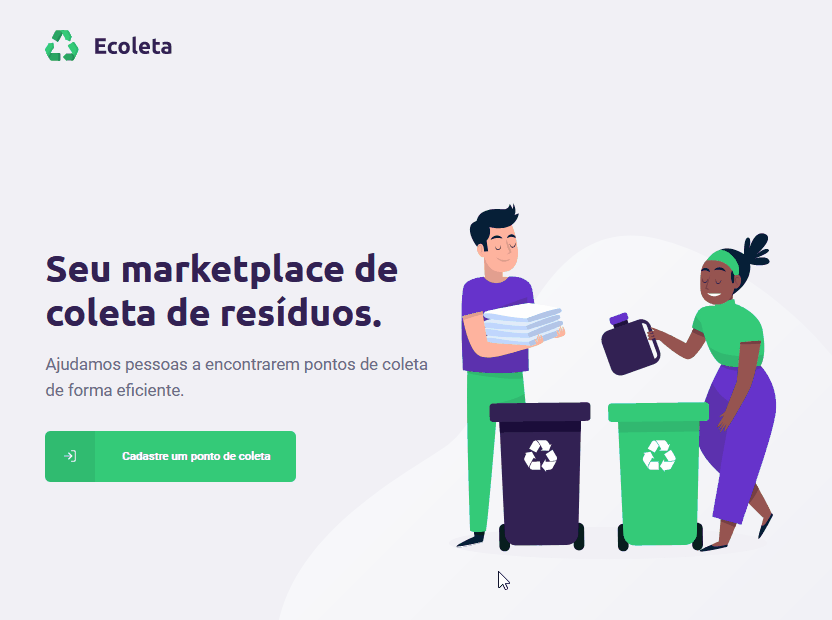
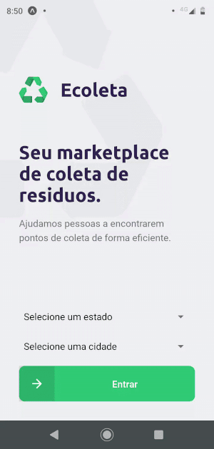

<h1 align="center">
    
</h1>

<h1 align="center" style='font-weight: bold'>
	 Next Level Week 1.0 🚀 
</h4>
<p align="center">
  

  <a href="https://github.com/mcoutinho88" target="_blank">
    
  </a>
  
  <a href="https://www.linkedin.com/in/matheus-coutinho-cavalcante-569575173/" target="_blank" >
    
  </a>
  <a href="mailto:matheuscavalcante88@hotmail.com" target="_blank" >
    
  </a>
  
</p>

<p align="center">
  <a href="#information_source-nlw---o-que-é-a-next-level-week">Next Level Week</a>&nbsp;&nbsp;&nbsp;|&nbsp;&nbsp;&nbsp;
  <a href="#-projeto">Projeto</a>&nbsp;&nbsp;&nbsp;|&nbsp;&nbsp;&nbsp;
  <a href="#rocket-tecnologias">Tecnologias</a>&nbsp;&nbsp;&nbsp;|&nbsp;&nbsp;&nbsp;
  <a href="#-layout">Layout</a>&nbsp;&nbsp;&nbsp;|&nbsp;&nbsp;&nbsp;
  <a href="#information_source-como-usar">Como usar</a>&nbsp;&nbsp;&nbsp;|&nbsp;&nbsp;&nbsp;
  <a href="#-como-contribuir">Como contribuir</a>&nbsp;&nbsp;&nbsp;|&nbsp;&nbsp;&nbsp;
  <a href="#memo-license">License</a>
</p>

## :information_source: O que é a Next Level Week?

Next Level Week (NLW) é uma semana prática com muito código e desafios, onde tem como um único objetivo: **levá-lo ao próximo nível**.

Através do método da Rocketseat, aprenderemos novas ferramentas, novas tecnologias e descobriremos hacks que irão impulsionar sua carreira.
Um evento online e totalmente gratuito que o ajudará a dar o próximo passo na sua evolução como desenvolvedor.

## 💻 Projeto

O **Ecoleta** é um projeto desenvolvido com base na semana internacional do meio ambiente.
O objetivo é conectar pessoas a empresas que coletam resíduos específicos, como lâmpadas, baterias, etc.

<h1 align="center">
    
</h1>



<h1 align="center">
  
</h1>

## :rocket: Tecnologias

Este projeto foi desenvolvido com as seguintes tecnologias:

- [Node.js][node]
- [React][react]
- [React Native][rn]
- [TypeScript][typescript]

## 🔖 Layout

Para acessar o layout, basta acessar o seguinte link: [Figma](<https://www.figma.com/file/9TlOcj6l7D05fZhU12xWT3/Ecoleta-(Booster)>).

## :information_source: Como usar

Para clonar e executar este aplicativo, você precisará do [Git](https://git-scm.com) instalado no seu computador, ou simplesmente baixe o aplicativo compactado [LINK](https://github.com/mcoutinho88/next-level-week/archive/master.zip)

### Instalando

```bash
# Clonando o repositório
$ git clone https://github.com/mcoutinho88/next-level-week

################# BACKEND ####################
# Acessando o diretório do backend
$ cd './server'
# Instalando as dependências
$ yarn OU npm install
# Rodando as migrations
$ knex:migrate
# Rodando as seeds
$ knex:seed
# Rodando a aplicação em modo desenvolvimento
$ yarn dev OU node run dev

############## FRONTEND WEB ##################
# Acessando o diretório do frontend
$ cd './web'
# Instalando as dependências
$ yarn OU npm install
# Rodando a aplicação web
$ yarn start OU npm start

################ MOBILE #####################
# Acessando o diretório do Mobile
$ cd './mobile'
# Instalando as dependências
$ yarn OU npm install
# Rodando a aplicação mobile
$ expo start
# No seu celular, baixar o aplicativo Expo via Google Play ou Apple Store
# Scan QRCode do seu browser com o aplicativo Expo
```

## 🤔 Como contribuir

- Realize um fork;
- Crie uma branch: `git checkout -b my-feature`;
- Envie suas mudanças: `git commit -m 'feat: My new feature'`;
- Faça um push da sua branch: `git push origin my-feature`.

Depois que a sua solicitação de recebimento for feita o merging, você pode excluir a sua branch.

## :memo: License

Este projeto está sob licença MIT, para mais detalhes verifique em [LICENSE](../../LICENSE.md)

Feito com ♥ por Matheus Coutinho :wave: 

[node]: https://nodejs.org/en/
[react]: https://reactjs.org
[rn]: https://facebook.github.io/react-native/
[typescript]: https://www.typescriptlang.org/